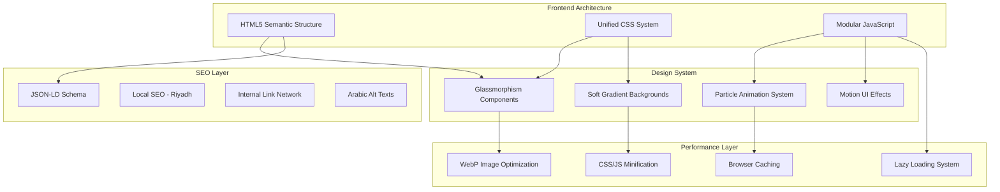

# Design Document

## Overview

This design document outlines the comprehensive redesign of the BrightAI website, implementing a modern Glassmorphism design system with soft gradients, smart animated backgrounds, enhanced performance optimization, and local SEO improvements for Riyadh. The redesign maintains all existing title and meta description tags while enhancing the visual experience, user interactions, and technical performance across all pages.

The architecture follows a component-based approach with shared CSS variables, reusable JavaScript modules, and consistent design patterns across all pages. The implementation prioritizes Core Web Vitals optimization, accessibility compliance, and Arabic RTL support.

## Architecture



## Components and Interfaces

### 1. Design System Components

#### 1.1 Glassmorphism Card Component

```css
/* Glassmorphism Card Base */
.glass-card {
    background: rgba(17, 34, 64, 0.7);
    backdrop-filter: blur(12px);
    -webkit-backdrop-filter: blur(12px);
    border: 1px solid rgba(100, 255, 218, 0.15);
    border-radius: 16px;
    box-shadow: 0 8px 32px rgba(0, 0, 0, 0.2);
    transition: transform 0.3s ease, box-shadow 0.3s ease, background 0.3s ease;
}

.glass-card:hover {
    transform: translateY(-8px);
    box-shadow: 0 16px 48px rgba(0, 0, 0, 0.3);
    background: rgba(17, 34, 64, 0.85);
}
```

#### 1.2 Soft Gradient Background System

```css
/* Multi-layer Gradient Background */
.gradient-background {
    background: 
        linear-gradient(135deg, rgba(10, 25, 47, 0.95) 0%, rgba(17, 34, 64, 0.9) 50%, rgba(10, 25, 47, 0.95) 100%),
        radial-gradient(ellipse at 20% 80%, rgba(100, 255, 218, 0.1) 0%, transparent 50%),
        radial-gradient(ellipse at 80% 20%, rgba(100, 255, 218, 0.08) 0%, transparent 50%);
    animation: gradientShift 20s ease infinite;
}

@keyframes gradientShift {
    0%, 100% { background-position: 0% 50%; }
    50% { background-position: 100% 50%; }
}
```

#### 1.3 Particle System Interface

```typescript
interface ParticleConfig {
    count: number;           // Number of particles (reduced on mobile)
    color: string;           // Particle color (--primary-color)
    opacity: number;         // Base opacity (0.3-0.5)
    speed: number;           // Movement speed
    connectionDistance: number; // Max distance for line connections
    respectReducedMotion: boolean; // Honor prefers-reduced-motion
}

interface ParticleSystem {
    init(canvas: HTMLCanvasElement, config: ParticleConfig): void;
    start(): void;
    stop(): void;
    resize(): void;
    destroy(): void;
}
```

### 2. Animation System

#### 2.1 Scroll Animation Observer

```typescript
interface ScrollAnimationConfig {
    threshold: number;       // Intersection threshold (0.1)
    rootMargin: string;      // Observer margin ("-50px")
    animationClass: string;  // Class to add on intersection
    once: boolean;           // Animate only once
}

interface AnimationObserver {
    observe(elements: NodeListOf<Element>): void;
    disconnect(): void;
}
```

#### 2.2 Micro-Interaction System

```typescript
interface MicroInteraction {
    type: 'click' | 'hover' | 'focus' | 'submit';
    element: string;         // CSS selector
    animation: string;       // Animation name
    duration: number;        // Duration in ms
    feedback: 'visual' | 'haptic' | 'both';
}
```

### 3. Performance Components

#### 3.1 Image Optimization Pipeline

```typescript
interface ImageOptimization {
    format: 'webp' | 'avif';
    fallback: 'png' | 'jpg';
    sizes: number[];         // Responsive sizes
    lazyLoad: boolean;
    placeholder: 'blur' | 'color' | 'none';
}

interface LazyLoadConfig {
    rootMargin: string;      // "200px" for preloading
    threshold: number;       // 0.01 for early trigger
    useNative: boolean;      // Use loading="lazy" when supported
}
```

#### 3.2 Script Loading Strategy

```typescript
interface ScriptConfig {
    src: string;
    async: boolean;
    defer: boolean;
    priority: 'critical' | 'high' | 'low';
    preload: boolean;
}
```

### 4. SEO Components

#### 4.1 LocalBusiness Schema Structure

```json
{
    "@context": "https://schema.org",
    "@type": "LocalBusiness",
    "name": "مُشرقة AI",
    "alternateName": ["Bright AI", "شركة مُشرقة للذكاء الاصطناعي"],
    "url": "https://brightai.site/",
    "logo": "https://brightai.site/logo.png",
    "image": "https://brightai.site/office-riyadh.webp",
    "description": "شركة مُشرقة AI، مؤسسة سعودية رائدة في حلول الذكاء الاصطناعي بالرياض",
    "address": {
        "@type": "PostalAddress",
        "streetAddress": "مقر شركة مُشرقة AI الرئيسي",
        "addressLocality": "الرياض",
        "addressRegion": "منطقة الرياض",
        "postalCode": "11564",
        "addressCountry": "SA"
    },
    "geo": {
        "@type": "GeoCoordinates",
        "latitude": "24.7136",
        "longitude": "46.6753"
    },
    "telephone": "+966-53-822-9013",
    "email": "info@brightaii.com",
    "openingHours": "Su-Th 09:00-18:00",
    "priceRange": "$$",
    "areaServed": ["الرياض", "جدة", "الدمام", "المملكة العربية السعودية"]
}
```

## Data Models

### 1. Page Configuration Model

```typescript
interface PageConfig {
    id: string;
    title: string;           // Preserved - DO NOT MODIFY
    metaDescription: string; // Preserved - DO NOT MODIFY
    h1Content: string;       // New H1 with keywords
    heroSection: HeroConfig;
    sections: SectionConfig[];
    schema: SchemaConfig[];
    internalLinks: InternalLink[];
}

interface HeroConfig {
    miniTitle: string;
    mainTitle: string;
    description: string;
    ctaPrimary: CTAButton;
    ctaSecondary: CTAButton;
    backgroundType: 'particles' | 'gradient' | 'video';
}

interface SectionConfig {
    id: string;
    type: 'cards' | 'features' | 'testimonials' | 'faq' | 'form' | 'metrics';
    title: string;
    content: any;
    animation: AnimationConfig;
}
```

### 2. Component State Model

```typescript
interface ComponentState {
    isVisible: boolean;
    isAnimated: boolean;
    isLoaded: boolean;
    interactionCount: number;
}

interface GlobalState {
    theme: 'dark' | 'light';
    reducedMotion: boolean;
    isMobile: boolean;
    scrollPosition: number;
    activeSection: string;
}
```

### 3. Analytics Event Model

```typescript
interface AnalyticsEvent {
    event: string;
    category: string;
    action: string;
    label: string;
    value?: number;
    customDimensions?: {
        saudi_user_city?: string;
        saudi_service_interest?: string;
    };
}
```

## Correctness Properties

*A property is a characteristic or behavior that should hold true across all valid executions of a system—essentially, a formal statement about what the system should do. Properties serve as the bridge between human-readable specifications and machine-verifiable correctness guarantees.*


### Property 1: Glassmorphism CSS Variables Consistency

*For any* page in the website, all glass-card elements SHALL have backdrop-filter with blur value between 8px and 16px, and background-color with alpha value between 0.1 and 0.3.

**Validates: Requirements 1.1**

### Property 2: Color Palette Consistency

*For any* CSS file in the project, all color values used for primary, accent, and neutral colors SHALL reference the defined CSS custom properties (--primary-color, --secondary-color, --accent-color, etc.) rather than hardcoded values.

**Validates: Requirements 1.5**

### Property 3: Reduced Motion Compliance

*For any* animation or transition in the system, WHEN prefers-reduced-motion media query is active, the animation duration SHALL be 0ms or the animation SHALL be disabled entirely.

**Validates: Requirements 2.4, 9.4**

### Property 4: Mobile Particle Optimization

*For any* viewport width less than 768px, the particle system SHALL either be disabled or have particle count reduced to less than 50% of desktop count.

**Validates: Requirements 2.5**

### Property 5: Lazy Loading for Particle System

*For any* page load, the particle system initialization SHALL NOT block the DOMContentLoaded event, and SHALL be deferred using requestIdleCallback or setTimeout.

**Validates: Requirements 2.6**

### Property 6: Scroll Animation Observer

*For any* element with fade-in animation class, the element SHALL only receive the 'visible' class WHEN it intersects with the viewport as detected by IntersectionObserver.

**Validates: Requirements 3.1, 3.5**

### Property 7: Form Submission Feedback

*For any* form submission event, the system SHALL display a notification element within 500ms of submission, and the notification SHALL be visible for at least 3 seconds.

**Validates: Requirements 3.3, 3.4**

### Property 8: WebP Image Format

*For any* image element on the page (excluding SVG icons), the src or srcset SHALL reference a WebP format file, with a fallback mechanism for older browsers.

**Validates: Requirements 4.1**

### Property 9: SVG Icon Format

*For any* icon element in the navigation, cards, or UI components, the icon SHALL be rendered as SVG (inline or external) rather than raster image format.

**Validates: Requirements 4.2**

### Property 10: Media Lazy Loading

*For any* image or video element that is not in the initial viewport (below the fold), the element SHALL have loading="lazy" attribute or be loaded via IntersectionObserver.

**Validates: Requirements 4.3, 4.4**

### Property 11: Script Async/Defer Attributes

*For any* external script tag in the HTML, the script SHALL have either async or defer attribute, except for critical inline scripts.

**Validates: Requirements 4.7**

### Property 12: Critical Resource Preloading

*For any* page, the head section SHALL contain preload links for: primary font files, hero section images, and critical CSS.

**Validates: Requirements 4.9**

### Property 13: Local Keywords in Headings

*For any* page, the H1 element SHALL contain at least one of the following keywords: "الرياض" (Riyadh), "السعودية" (Saudi), "الذكاء الاصطناعي" (AI).

**Validates: Requirements 5.1**

### Property 14: Riyadh Mention in First Paragraph

*For any* page with content sections, the first paragraph element after the hero section SHALL contain the word "الرياض" or "Riyadh".

**Validates: Requirements 5.2**

### Property 15: Arabic Alt Text for Images

*For any* img element on the page, the alt attribute SHALL be non-empty and contain Arabic characters (Unicode range 0600-06FF).

**Validates: Requirements 5.3, 9.5**

### Property 16: LocalBusiness Schema Validation

*For any* page, the head section SHALL contain a valid JSON-LD script with @type "LocalBusiness" or "Organization" that includes: name, address.addressLocality="الرياض", telephone, and openingHours fields.

**Validates: Requirements 5.4, 5.5**

### Property 17: Sitemap and Robots Completeness

*For the* sitemap.xml file, all HTML pages in the website SHALL be listed as URL entries, and robots.txt SHALL reference the sitemap location.

**Validates: Requirements 5.7**

### Property 18: Social Meta Tags

*For any* page, the head section SHALL contain og:title, og:description, og:image meta tags AND twitter:card, twitter:title, twitter:description meta tags.

**Validates: Requirements 5.8**

### Property 19: Logo Homepage Link

*For any* page, the logo element in the header SHALL be wrapped in an anchor tag with href pointing to "/" or the homepage URL.

**Validates: Requirements 6.1**

### Property 20: Navigation Menu Completeness

*For the* main navigation menu, it SHALL contain links to at least: homepage, services, about, contact, and library sections.

**Validates: Requirements 6.2**

### Property 21: Descriptive Arabic Anchor Text

*For any* internal link in the content area, the anchor text SHALL be non-empty, contain Arabic characters, and be descriptive (more than 2 characters).

**Validates: Requirements 6.4**

### Property 22: Internal Link Presence

*For any* page, the content area SHALL contain at least one internal link to another page on the same domain.

**Validates: Requirements 6.5**

### Property 23: RTL Language Attributes

*For any* page, the html element SHALL have lang="ar" and dir="rtl" attributes set.

**Validates: Requirements 7.1**

### Property 24: RTL CSS Direction

*For the* body element, the computed style SHALL have direction: rtl.

**Validates: Requirements 7.2**

### Property 25: Arabic Content Verification

*For any* visible text content in UI elements (buttons, labels, headings), the text SHALL contain Arabic characters (Unicode range 0600-06FF).

**Validates: Requirements 7.4**

### Property 26: Responsive Layout System

*For the* main CSS file, it SHALL contain CSS Grid or Flexbox display properties for layout containers.

**Validates: Requirements 8.1**

### Property 27: Mobile-First Media Queries

*For any* media query in the CSS, the majority SHALL use min-width (mobile-first) rather than max-width breakpoints.

**Validates: Requirements 8.2**

### Property 28: Touch Target Size

*For any* interactive element (button, link, input) on mobile viewport, the element SHALL have minimum dimensions of 44x44 pixels.

**Validates: Requirements 8.5**

### Property 29: Keyboard Navigation Order

*For any* page, all interactive elements SHALL have a logical tabindex sequence (no positive tabindex values that break natural order).

**Validates: Requirements 9.2**

### Property 30: ARIA Labels for Buttons

*For any* button element without visible text content, the button SHALL have an aria-label or aria-labelledby attribute.

**Validates: Requirements 9.3**

### Property 31: Analytics Script Configuration

*For any* page, the Google Analytics script SHALL have async attribute and be placed in head or before closing body tag.

**Validates: Requirements 10.1, 10.2**

### Property 32: Analytics Event Tracking

*For any* CTA button click, the click handler SHALL push an event object to window.dataLayer with event name and relevant parameters.

**Validates: Requirements 10.3**

### Property 33: Form Analytics Tracking

*For any* form submission, the submit handler SHALL push a 'generate_lead' or similar event to window.dataLayer.

**Validates: Requirements 10.4**

### Property 34: Favicon Links

*For any* page, the head section SHALL contain link tags for favicons in sizes: 32x32, 64x64 (or 48x48), and 180x180 (apple-touch-icon).

**Validates: Requirements 11.1, 11.2, 11.3, 11.4, 11.5**

### Property 35: Semantic HTML Structure

*For any* page, the body SHALL contain semantic HTML5 elements: header, nav, main, and footer in proper hierarchy.

**Validates: Requirements 22.1**

### Property 36: Single H1 Per Page

*For any* page, there SHALL be exactly one H1 element.

**Validates: Requirements 22.2**

### Property 37: Heading Hierarchy

*For any* page, heading elements SHALL follow proper hierarchy (H2 after H1, H3 after H2, etc.) without skipping levels.

**Validates: Requirements 22.3**

## Error Handling

### 1. Animation System Errors

```typescript
// Graceful degradation for animation failures
try {
    initParticleSystem(canvas, config);
} catch (error) {
    console.warn('[Particles] Failed to initialize:', error);
    // Fallback to static gradient background
    canvas.parentElement.classList.add('fallback-gradient');
}
```

### 2. Image Loading Errors

```typescript
// WebP fallback handling
img.onerror = function() {
    if (this.src.endsWith('.webp')) {
        this.src = this.src.replace('.webp', '.png');
    }
};
```

### 3. Form Submission Errors

```typescript
// Network error handling for forms
try {
    await submitForm(formData);
    showNotification('success', 'تم الإرسال بنجاح');
} catch (error) {
    showNotification('error', 'حدث خطأ، يرجى المحاولة مرة أخرى');
    logError('form_submission', error);
}
```

### 4. Analytics Errors

```typescript
// Safe analytics push
function safeDataLayerPush(event) {
    try {
        window.dataLayer = window.dataLayer || [];
        window.dataLayer.push(event);
    } catch (error) {
        console.warn('[Analytics] Failed to push event:', error);
    }
}
```

## Testing Strategy

### Unit Tests

Unit tests will verify specific examples and edge cases:

1. **CSS Variable Tests**: Verify CSS custom properties are defined with correct values
2. **DOM Structure Tests**: Verify semantic HTML elements are present
3. **Schema Validation Tests**: Verify JSON-LD schema is valid and complete
4. **Accessibility Tests**: Verify ARIA attributes and keyboard navigation
5. **RTL Tests**: Verify Arabic text direction and alignment

### Property-Based Tests

Property-based tests will use a testing library (e.g., fast-check for JavaScript) to verify universal properties across many generated inputs:

1. **Image Format Property**: Generate random image paths and verify WebP format
2. **Alt Text Property**: Generate random images and verify Arabic alt text presence
3. **Link Property**: Generate random pages and verify internal link presence
4. **Heading Property**: Generate random page structures and verify H1 uniqueness
5. **Animation Property**: Generate random scroll positions and verify animation triggers

**Property Test Configuration**:
- Minimum 100 iterations per property test
- Each test tagged with: **Feature: brightai-redesign, Property {number}: {property_text}**
- Use Jest with fast-check for property-based testing

### Integration Tests

1. **Page Load Performance**: Verify Core Web Vitals metrics
2. **Cross-Browser Compatibility**: Test on Chrome, Firefox, Safari, Edge
3. **Mobile Responsiveness**: Test on various viewport sizes
4. **RTL Layout**: Verify correct rendering in RTL mode

### Accessibility Testing

1. **WCAG 2.1 AA Compliance**: Use axe-core for automated testing
2. **Screen Reader Testing**: Manual testing with VoiceOver/NVDA
3. **Keyboard Navigation**: Verify all interactive elements are accessible
4. **Color Contrast**: Verify minimum 4.5:1 contrast ratio
