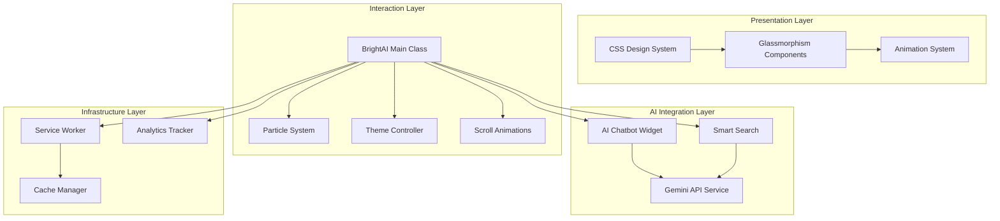

# Design Document: BrightAI Website Transformation

## Overview

This design document outlines the technical architecture for transforming the BrightAI website into a world-class, AI-powered platform. The transformation builds upon the existing codebase (RTL Arabic support, Google Analytics integration) while adding glassmorphism design, particle animations, Gemini AI chatbot, smart search, and PWA capabilities.

The implementation follows a modular approach with clear separation between:
- **Presentation Layer**: Glassmorphism CSS system with animations
- **Interaction Layer**: JavaScript modules for UI behaviors
- **AI Integration Layer**: Gemini API services for chatbot and search
- **Infrastructure Layer**: PWA, caching, and performance optimizations

## Architecture



## Components and Interfaces

### 1. CSS Design System

The CSS system uses CSS custom properties for theming and consistent styling.

```css
/* Design Tokens Interface */
:root {
  /* Glassmorphism Colors */
  --glass-bg: rgba(255, 255, 255, 0.08);
  --glass-border: rgba(255, 255, 255, 0.18);
  --glass-shadow: 0 8px 32px rgba(0, 0, 0, 0.1);
  
  /* AI Brand Palette */
  --primary-gradient: linear-gradient(135deg, #667eea 0%, #764ba2 100%);
  --secondary-gradient: linear-gradient(135deg, #f093fb 0%, #f5576c 100%);
  --accent-gradient: linear-gradient(135deg, #4facfe 0%, #00f2fe 100%);
  
  /* Animation Timings */
  --transition-fast: 150ms cubic-bezier(0.4, 0, 0.2, 1);
  --transition-base: 300ms cubic-bezier(0.4, 0, 0.2, 1);
  --transition-slow: 500ms cubic-bezier(0.4, 0, 0.2, 1);
}
```

### 2. Glassmorphism Component System

```typescript
interface GlassComponent {
  background: string;      // Semi-transparent background
  backdropFilter: string;  // Blur and saturation
  border: string;          // Subtle border
  borderRadius: string;    // Rounded corners
  boxShadow: string;       // Soft shadow
}

interface GlassCard extends GlassComponent {
  hoverTransform: string;  // Transform on hover
  hoverShadow: string;     // Enhanced shadow on hover
}
```

### 3. Particle System

```typescript
interface Particle {
  x: number;
  y: number;
  size: number;
  speedX: number;
  speedY: number;
  color: string;
  
  update(): void;
  draw(ctx: CanvasRenderingContext2D): void;
}

interface ParticleSystem {
  canvas: HTMLCanvasElement;
  ctx: CanvasRenderingContext2D;
  particles: Particle[];
  connectionDistance: number;  // 120px default
  
  init(): void;
  animate(): void;
  connectParticles(): void;
  handleResize(): void;
}
```

### 4. AI Chatbot Interface

```typescript
interface ChatMessage {
  id: string;
  text: string;
  sender: 'user' | 'bot';
  timestamp: Date;
}

interface AIChatbot {
  apiKey: string;
  endpoint: string;
  conversationHistory: ChatMessage[];
  isMinimized: boolean;
  
  createWidget(): HTMLElement;
  sendMessage(message: string): Promise<string>;
  addMessage(text: string, sender: 'user' | 'bot'): void;
  toggleMinimize(): void;
}

interface GeminiRequest {
  contents: Array<{
    parts: Array<{ text: string }>;
  }>;
}

interface GeminiResponse {
  candidates: Array<{
    content: {
      parts: Array<{ text: string }>;
    };
  }>;
}
```

### 5. Smart Search Interface

```typescript
interface SearchResult {
  title: string;
  url: string;
  description: string;
}

interface SmartSearch {
  apiKey: string;
  debounceTimer: number;
  minQueryLength: number;  // 3 characters
  
  performSearch(query: string): Promise<SearchResult[]>;
  displayResults(results: SearchResult[]): void;
}
```

### 6. Theme Controller Interface

```typescript
interface ThemeController {
  currentTheme: 'light' | 'dark';
  storageKey: string;
  
  applyTheme(theme: 'light' | 'dark'): void;
  toggleTheme(): void;
  loadSavedTheme(): void;
}
```

### 7. Main Application Class

```typescript
interface BrightAIApp {
  particleSystem: ParticleSystem;
  chatbot: AIChatbot;
  smartSearch: SmartSearch;
  themeController: ThemeController;
  
  init(): Promise<void>;
  setupBackgroundAnimation(): void;
  setupScrollAnimations(): void;
  setupLazyLoading(): void;
  initAIChatbot(): void;
  setupAnalytics(): void;
  setupServiceWorker(): Promise<void>;
}
```

### 8. Trust Signals Interface

```typescript
interface TrustBadge {
  id: string;
  name: string;           // e.g., "شركة سعودية 100%", "ISO 27001"
  icon: string;           // Icon path or SVG
  description?: string;
}

interface TrustBar {
  badges: TrustBadge[];
  position: 'top' | 'hero' | 'footer';
  
  render(): HTMLElement;
  animateIn(): void;
}
```

### 9. Client Logos Interface

```typescript
interface ClientLogo {
  id: string;
  name: string;           // Company name in Arabic
  logoUrl: string;
  websiteUrl?: string;
}

interface ClientLogosSection {
  logos: ClientLogo[];
  heading: string;        // "عملاؤنا الموثوقون"
  
  render(): HTMLElement;
  setupHoverEffects(): void;
}
```

### 10. Testimonials Interface

```typescript
interface Testimonial {
  id: string;
  quote: string;          // Arabic testimonial text
  clientName: string;
  position: string;
  company: string;
  rating: number;         // 1-5 stars
  avatar?: string;
}

interface TestimonialsCarousel {
  testimonials: Testimonial[];
  currentIndex: number;
  autoPlayInterval: number;
  
  render(): HTMLElement;
  next(): void;
  prev(): void;
  goTo(index: number): void;
  startAutoPlay(): void;
  stopAutoPlay(): void;
}
```

### 11. Contact Options Interface

```typescript
interface ContactOption {
  type: 'whatsapp' | 'phone' | 'email' | 'location';
  value: string;
  displayValue: string;   // Arabic formatted
  icon: string;
  isPrimary: boolean;
}

interface ContactSection {
  options: ContactOption[];
  whatsappNumber: string; // +966XXXXXXXXX
  
  render(): HTMLElement;
  createFloatingWhatsApp(): HTMLElement;
  formatSaudiPhone(phone: string): string;
}
```

### 12. Pricing Section Interface

```typescript
interface PricingFeature {
  text: string;
  included: boolean;
}

interface PricingTier {
  id: string;
  name: string;           // "الباقة الأساسية", "الباقة الاحترافية", "باقة مخصصة"
  price: string;          // "٥٠,٠٠٠ ريال" or "تواصل معنا"
  period?: string;        // "سنوياً"
  features: PricingFeature[];
  ctaText: string;
  isPopular: boolean;     // Shows "الأكثر طلباً" badge
  isCustom: boolean;
}

interface PricingSection {
  tiers: PricingTier[];
  vatNote: string;        // "جميع الأسعار شاملة ضريبة القيمة المضافة"
  
  render(): HTMLElement;
  highlightPopular(): void;
}
```

### 13. Urgency Elements Interface

```typescript
interface CountdownTimer {
  targetDate: Date;
  container: HTMLElement;
  
  start(): void;
  stop(): void;
  update(): void;
  formatTime(ms: number): { days: number; hours: number; minutes: number; seconds: number };
}

interface ScarcityIndicator {
  totalSpots: number;
  remainingSpots: number;
  
  render(): HTMLElement;
  update(remaining: number): void;
}

interface LiveNotification {
  messages: string[];
  interval: number;       // ms between notifications
  
  show(message: string): void;
  startRotation(): void;
  stopRotation(): void;
}

interface UrgencyBanner {
  countdown: CountdownTimer;
  scarcity: ScarcityIndicator;
  notifications: LiveNotification;
  
  render(): HTMLElement;
}
```

### 14. Advanced Analytics Interface

```typescript
interface HeatmapConfig {
  provider: 'hotjar' | 'clarity';
  siteId: string;
}

interface FormTrackingEvent {
  formId: string;
  fieldName: string;
  eventType: 'focus' | 'blur' | 'change' | 'submit' | 'abandon';
  timestamp: number;
  value?: string;
}

interface VideoTrackingEvent {
  videoId: string;
  eventType: 'play' | 'pause' | 'ended' | 'progress';
  currentTime: number;
  duration: number;
  percentComplete: number;
}

interface AdvancedAnalytics {
  heatmapConfig: HeatmapConfig;
  
  initHeatmap(): void;
  trackFormInteraction(event: FormTrackingEvent): void;
  trackVideoEngagement(event: VideoTrackingEvent): void;
  trackScrollDepth(percentage: number): void;
  pushToDataLayer(event: object): void;
}
```

## Data Models

### Chat Message Model

```typescript
interface ChatMessageModel {
  id: string;           // UUID
  text: string;         // Message content
  sender: 'user' | 'bot';
  timestamp: number;    // Unix timestamp
  status: 'sending' | 'sent' | 'error';
}
```

### Theme Preference Model

```typescript
interface ThemePreference {
  theme: 'light' | 'dark';
  lastUpdated: number;
}
```

### Analytics Event Model

```typescript
interface AnalyticsEvent {
  event: string;
  category: string;
  label?: string;
  value?: number;
  timestamp: number;
}
```

### PWA Cache Model

```typescript
interface CacheConfig {
  name: string;
  version: string;
  urls: string[];
}
```

### Trust Signal Model

```typescript
interface TrustSignalModel {
  id: string;
  type: 'badge' | 'certification' | 'partnership';
  name: string;
  nameAr: string;
  iconUrl: string;
  verificationUrl?: string;
}
```

### Pricing Model

```typescript
interface PricingModel {
  tierId: string;
  name: string;
  nameAr: string;
  priceValue: number;
  priceDisplay: string;    // "٥٠,٠٠٠ ريال"
  currency: 'SAR';
  period: 'yearly' | 'monthly' | 'one-time';
  features: string[];
  isPopular: boolean;
  isCustom: boolean;
}
```

### Urgency Model

```typescript
interface UrgencyModel {
  countdownTarget: Date;
  totalSpots: number;
  remainingSpots: number;
  offerName: string;
  offerNameAr: string;
}
```

### Form Tracking Model

```typescript
interface FormTrackingModel {
  formId: string;
  formName: string;
  fields: Array<{
    name: string;
    type: string;
    required: boolean;
  }>;
  interactions: FormTrackingEvent[];
  startTime: number;
  submitTime?: number;
  abandoned: boolean;
}
```

## Correctness Properties

*A property is a characteristic or behavior that should hold true across all valid executions of a system—essentially, a formal statement about what the system should do. Properties serve as the bridge between human-readable specifications and machine-verifiable correctness guarantees.*

### Property 1: RTL Direction Preservation

*For any* page in the website, the `<html>` element SHALL have `dir="rtl"` and `lang="ar"` attributes preserved after transformation.

**Validates: Requirements 1.1**

### Property 2: Meta Tag Preservation

*For any* page transformation, the original `<title>` and `<meta name="description">` content SHALL remain unchanged.

**Validates: Requirements 1.3**

### Property 3: Image Alt Text in Arabic

*For any* `` element in the website, the `alt` attribute SHALL exist and contain Arabic characters (Unicode range \u0600-\u06FF).

**Validates: Requirements 1.8**

### Property 4: Glassmorphism Style Consistency

*For any* element with the `.glass` or `.glass-card` class, the computed style SHALL include: backdrop-filter with blur, semi-transparent background (alpha < 1), and border with semi-transparent color.

**Validates: Requirements 2.1, 2.2, 2.3**

### Property 5: Particle Connection Distance Threshold

*For any* two particles in the system, a connecting line SHALL be drawn if and only if the Euclidean distance between them is less than 120 pixels.

**Validates: Requirements 3.2**

### Property 6: Particle Color Palette Compliance

*For any* particle in the system, its color SHALL be one of the defined AI brand colors (purple, pink, blue gradient palette).

**Validates: Requirements 3.3**

### Property 7: Mobile Particle Count Optimization

*For any* viewport width less than 768px, the particle system SHALL initialize with no more than 30 particles.

**Validates: Requirements 3.4**

### Property 8: Reduced Motion Preference Compliance

*For any* user with `prefers-reduced-motion: reduce` media query active, the particle animation loop SHALL NOT execute (no `requestAnimationFrame` calls).

**Validates: Requirements 3.5**

### Property 9: Canvas Resize Handling

*For any* window resize event, the canvas dimensions SHALL be updated to match the container dimensions within one animation frame.

**Validates: Requirements 3.7**

### Property 10: Chatbot Conversation History Preservation

*For any* sequence of messages sent to the chatbot, all messages (both user and bot) SHALL be preserved in the conversation history array in chronological order.

**Validates: Requirements 4.6**

### Property 11: Smart Search Debounce Behavior

*For any* sequence of rapid keystrokes (within 300ms intervals), the search API SHALL only be called once after the final keystroke plus 300ms delay.

**Validates: Requirements 5.1**

### Property 12: Smart Search Minimum Query Length

*For any* search query with fewer than 3 characters, the `performSearch` function SHALL NOT make an API request.

**Validates: Requirements 5.2**

### Property 13: Search Result Display Completeness

*For any* search result returned from the API, the rendered output SHALL contain the title, URL, and description fields.

**Validates: Requirements 5.4**

### Property 14: Scroll Animation Lifecycle

*For any* element with `.animate-trigger` class, when it enters the viewport (intersection ratio > 0.1), the animation class SHALL be added AND the element SHALL be unobserved.

**Validates: Requirements 6.2, 6.3**

### Property 15: Theme Persistence Round-Trip

*For any* theme selection (light or dark), after saving to localStorage and reloading the page, the `loadSavedTheme()` function SHALL restore the same theme value.

**Validates: Requirements 7.1, 7.4**

### Property 16: Theme Toggle Behavior

*For any* theme toggle action, the `data-theme` attribute on the document element SHALL switch to the opposite value (light ↔ dark).

**Validates: Requirements 7.2, 7.3**

### Property 17: Service Worker Cache Consistency

*For any* URL in the cache list, after caching, a subsequent fetch request for that URL while offline SHALL return the cached response.

**Validates: Requirements 8.2, 8.3**

### Property 18: Lazy Loading Images

*For any* `` element below the initial viewport fold, the `loading` attribute SHALL be set to "lazy".

**Validates: Requirements 9.2**

### Property 19: Keyboard Navigation Support

*For any* interactive element (buttons, links, inputs), the element SHALL be focusable via Tab key navigation.

**Validates: Requirements 10.2**

### Property 20: Focus Indicator Visibility

*For any* focusable element receiving keyboard focus (`:focus-visible`), the element SHALL display a visible outline with minimum 3px width.

**Validates: Requirements 10.3**

### Property 21: Touch Target Size

*For any* interactive element on viewport width less than 768px, the element's clickable area SHALL be at least 44x44 pixels.

**Validates: Requirements 10.4**

### Property 22: Responsive Single Column Layout

*For any* grid container on viewport width less than 768px, the grid SHALL display as a single column layout.

**Validates: Requirements 11.3**

### Property 23: Mobile Cursor Disabled

*For any* viewport width less than or equal to 768px, the custom magnetic cursor effect SHALL NOT be initialized.

**Validates: Requirements 11.4**

### Property 24: Counter Animation on Viewport Entry

*For any* stat counter element, when it enters the viewport, the displayed number SHALL animate from 0 to the target value specified in `data-count`.

**Validates: Requirements 13.2**

### Property 25: Desktop Cursor Enabled

*For any* viewport width greater than 768px, the custom magnetic cursor effect SHALL be initialized and active.

**Validates: Requirements 14.4**

### Property 26: Trust Badge Visibility

*For any* page load on the homepage, the trust bar with "شركة سعودية 100%" badge SHALL be visible above the fold within 500ms.

**Validates: Requirements 15.1, 15.5**

### Property 27: Client Logos Grid Responsiveness

*For any* viewport width, the client logos grid SHALL display logos in a responsive layout without horizontal overflow.

**Validates: Requirements 16.1, 16.3**

### Property 28: Testimonial Content Completeness

*For any* testimonial displayed, the rendered output SHALL contain the quote, client name, position, company, and star rating.

**Validates: Requirements 17.1, 17.2, 17.4**

### Property 29: WhatsApp Button Visibility

*For any* page in the website, the floating WhatsApp button SHALL be visible and positioned in the bottom-right corner (RTL: bottom-left).

**Validates: Requirements 18.1, 18.2**

### Property 30: Pricing Tier Display

*For any* pricing section render, exactly three pricing tiers SHALL be displayed with the Professional tier marked as "الأكثر طلباً".

**Validates: Requirements 19.1, 19.3**

### Property 31: VAT Note Presence

*For any* pricing section, the VAT note "جميع الأسعار شاملة ضريبة القيمة المضافة" SHALL be displayed below the pricing cards.

**Validates: Requirements 19.5**

### Property 32: Countdown Timer Real-Time Update

*For any* countdown timer, the displayed time SHALL update every second and show days, hours, minutes, and seconds.

**Validates: Requirements 20.1, 20.5**

### Property 33: Live Notification Display

*For any* live notification trigger, the notification popup SHALL appear, display for 3-5 seconds, and animate out.

**Validates: Requirements 20.3**

### Property 34: Form Tracking Events

*For any* form field interaction (focus, blur, submit), a tracking event SHALL be pushed to dataLayer with form ID and field name.

**Validates: Requirements 21.2, 21.5**

### Property 35: Video Engagement Tracking

*For any* video play event, tracking events SHALL be pushed at play, pause, and completion milestones (25%, 50%, 75%, 100%).

**Validates: Requirements 21.3**

### Property 36: CTA Button Arabic Text

*For any* primary CTA button, the button text SHALL be in Arabic and match one of the approved CTAs ("ابدأ الآن", "احصل على استشارة مجانية", etc.).

**Validates: Requirements 22.1**

### Property 37: No API Keys in Client Code

*For any* JavaScript file served to the client, the file content SHALL NOT contain the string "GEMINI_API_KEY" or any API key pattern matching "AIza[0-9A-Za-z-_]{35}".

**Validates: Requirements 23.1**

### Property 38: Server Gateway Endpoint Availability

*For any* AI feature (chatbot or search), the client code SHALL call server endpoints (/api/ai/chat or /api/ai/search) and SHALL NOT call external AI APIs directly.

**Validates: Requirements 23.2, 23.3**

### Property 39: Rate Limiting Enforcement

*For any* IP address making more than 30 requests per minute to AI endpoints, the server SHALL return HTTP 429 status with an Arabic error message.

**Validates: Requirements 23.5**

### Property 40: Input Sanitization

*For any* user input containing HTML tags or script elements, the sanitizer SHALL escape or remove potentially dangerous content before processing.

**Validates: Requirements 23.6**

### Property 41: Canonical Tag Presence

*For any* HTML page in the website, there SHALL exist exactly one `<link rel="canonical">` tag with a valid URL.

**Validates: Requirements 24.3**

### Property 42: JSON-LD Schema Validity

*For any* JSON-LD script tag in the website, the content SHALL be valid parseable JSON with a "@context" property set to "https://schema.org".

**Validates: Requirements 24.4, 24.5, 24.6, 24.7, 24.8, 24.9**

### Property 43: Single H1 Per Page

*For any* HTML page in the website, there SHALL exist exactly one `<h1>` element.

**Validates: Requirements 24.12**

### Property 44: Open Graph Tags Presence

*For any* HTML page, the `<head>` section SHALL contain og:title, og:description, og:image, and og:url meta tags.

**Validates: Requirements 24.10**

### Property 45: Reduced Motion Animation Disabled

*For any* user with `prefers-reduced-motion: reduce` preference, all CSS animations and JavaScript animation loops SHALL be disabled or reduced.

**Validates: Requirements 3.5**

### 15. Server-Side AI Gateway Interface

```typescript
interface AIGatewayConfig {
  geminiApiKey: string;      // From process.env.GEMINI_API_KEY
  geminiModel: string;       // "gemini-2.5-flash"
  rateLimitPerMinute: number; // 30
  maxInputLength: number;    // 1000 characters
}

interface ChatRequest {
  message: string;
  sessionId?: string;
}

interface ChatResponse {
  reply: string;
  sessionId: string;
  error?: string;
}

interface SearchRequest {
  query: string;
}

interface SearchResponse {
  results: SearchResult[];
  error?: string;
}

interface RateLimiter {
  checkLimit(ip: string): boolean;
  recordRequest(ip: string): void;
  resetAfterMinute(): void;
}

interface InputSanitizer {
  sanitizeUserInput(input: string): string;
  filterAIResponse(response: string): string;
  escapeHTML(text: string): string;
}

// Server endpoints
// POST /api/ai/chat - Chatbot conversations
// POST /api/ai/search - Smart search suggestions
```

### 16. SEO Schema Interfaces

```typescript
interface OrganizationSchema {
  "@context": "https://schema.org";
  "@type": "Organization";
  name: string;
  url: string;
  logo: string;
  contactPoint: ContactPoint;
  address: PostalAddress;
  sameAs: string[];
}

interface LocalBusinessSchema {
  "@context": "https://schema.org";
  "@type": "LocalBusiness";
  name: string;
  image: string;
  telephone: string;  // +966 format
  address: {
    "@type": "PostalAddress";
    streetAddress: string;
    addressLocality: "الرياض";
    addressRegion: "منطقة الرياض";
    postalCode: string;
    addressCountry: "SA";
  };
  geo: {
    "@type": "GeoCoordinates";
    latitude: number;
    longitude: number;
  };
  openingHours: string;
  priceRange: string;
}

interface WebSiteSchema {
  "@context": "https://schema.org";
  "@type": "WebSite";
  name: string;
  url: string;
  potentialAction: {
    "@type": "SearchAction";
    target: string;
    "query-input": string;
  };
}

interface BreadcrumbSchema {
  "@context": "https://schema.org";
  "@type": "BreadcrumbList";
  itemListElement: Array<{
    "@type": "ListItem";
    position: number;
    name: string;
    item: string;
  }>;
}

interface ServiceSchema {
  "@context": "https://schema.org";
  "@type": "Service";
  name: string;
  description: string;
  provider: OrganizationSchema;
  areaServed: {
    "@type": "Country";
    name: "المملكة العربية السعودية";
  };
}

interface FAQSchema {
  "@context": "https://schema.org";
  "@type": "FAQPage";
  mainEntity: Array<{
    "@type": "Question";
    name: string;
    acceptedAnswer: {
      "@type": "Answer";
      text: string;
    };
  }>;
}
```

## Error Handling

### API Error Handling

```typescript
class APIError extends Error {
  constructor(
    message: string,
    public statusCode: number,
    public endpoint: string
  ) {
    super(message);
    this.name = 'APIError';
  }
}

// Chatbot error handling
async function handleChatbotError(error: Error): Promise<string> {
  console.error('Chatbot error:', error);
  return 'عذراً، حدث خطأ. يرجى المحاولة مرة أخرى.';
}

// Smart search error handling
async function handleSearchError(error: Error): Promise<SearchResult[]> {
  console.error('Search error:', error);
  return []; // Return empty results on error
}
```

### Canvas Error Handling

```typescript
function initCanvas(): CanvasRenderingContext2D | null {
  const canvas = document.getElementById('bg-canvas');
  if (!canvas || !(canvas instanceof HTMLCanvasElement)) {
    console.warn('Canvas element not found');
    return null;
  }
  
  const ctx = canvas.getContext('2d');
  if (!ctx) {
    console.warn('2D context not supported');
    return null;
  }
  
  return ctx;
}
```

### Service Worker Error Handling

```typescript
// sw.js
self.addEventListener('fetch', (event) => {
  event.respondWith(
    caches.match(event.request)
      .then(response => response || fetch(event.request))
      .catch(() => {
        // Return offline fallback for navigation requests
        if (event.request.mode === 'navigate') {
          return caches.match('/offline.html');
        }
        return new Response('Offline', { status: 503 });
      })
  );
});
```

### Theme Controller Error Handling

```typescript
function loadSavedTheme(): 'light' | 'dark' {
  try {
    const saved = localStorage.getItem('theme');
    if (saved === 'light' || saved === 'dark') {
      return saved;
    }
  } catch (error) {
    console.warn('localStorage not available:', error);
  }
  // Default to light theme
  return 'light';
}
```

## Testing Strategy

### Unit Tests

Unit tests will verify specific examples and edge cases:

1. **CSS Variable Tests**: Verify design tokens are correctly defined
2. **Particle Initialization Tests**: Test particle creation with correct properties
3. **Theme Toggle Tests**: Test theme switching logic
4. **Debounce Function Tests**: Test timing behavior
5. **Message Formatting Tests**: Test chat message display
6. **API Error Handling Tests**: Test error states return correct messages

### Property-Based Tests

Property-based tests will use **fast-check** library for JavaScript to verify universal properties across many generated inputs.

**Configuration:**
- Minimum 100 iterations per property test
- Each test tagged with: `Feature: brightai-website-transformation, Property N: [property_text]`

**Test Categories:**

1. **HTML Structure Properties**
   - RTL Direction Preservation (Property 1)
   - Meta Tag Preservation (Property 2)
   - Image Alt Text in Arabic (Property 3)

2. **Glassmorphism Properties**
   - Style Consistency (Property 4)

3. **Particle System Properties**
   - Connection Distance Threshold (Property 5)
   - Color Palette Compliance (Property 6)
   - Mobile Particle Count (Property 7)
   - Reduced Motion Compliance (Property 8)
   - Canvas Resize Handling (Property 9)

4. **Chatbot Properties**
   - Conversation History Preservation (Property 10)

5. **Search System Properties**
   - Debounce Behavior (Property 11)
   - Minimum Query Length (Property 12)
   - Result Display Completeness (Property 13)

6. **Animation Properties**
   - Scroll Animation Lifecycle (Property 14)
   - Counter Animation (Property 24)

7. **Theme System Properties**
   - Persistence Round-Trip (Property 15)
   - Toggle Behavior (Property 16)

8. **PWA Properties**
   - Cache Consistency (Property 17)

9. **Performance Properties**
   - Lazy Loading Images (Property 18)

10. **Accessibility Properties**
    - Keyboard Navigation (Property 19)
    - Focus Indicator Visibility (Property 20)
    - Touch Target Size (Property 21)

11. **Responsive Properties**
    - Single Column Layout (Property 22)
    - Mobile Cursor Disabled (Property 23)
    - Desktop Cursor Enabled (Property 25)

12. **Trust and Social Proof Properties**
    - Trust Badge Visibility (Property 26)
    - Client Logos Grid Responsiveness (Property 27)
    - Testimonial Content Completeness (Property 28)

13. **Contact and Communication Properties**
    - WhatsApp Button Visibility (Property 29)

14. **Pricing Properties**
    - Pricing Tier Display (Property 30)
    - VAT Note Presence (Property 31)

15. **Urgency and Scarcity Properties**
    - Countdown Timer Real-Time Update (Property 32)
    - Live Notification Display (Property 33)

16. **Advanced Analytics Properties**
    - Form Tracking Events (Property 34)
    - Video Engagement Tracking (Property 35)

17. **CTA Properties**
    - CTA Button Arabic Text (Property 36)

### Integration Tests

1. **Chatbot Flow**: Test complete message send/receive cycle with Gemini API
2. **PWA Installation**: Test service worker registration and caching
3. **Analytics Events**: Test event tracking fires correctly
4. **Responsive Behavior**: Test layout changes at breakpoints
5. **Theme Persistence**: Test theme survives page reload

### Test File Structure

```
tests/
├── unit/
│   ├── particle.test.js
│   ├── theme.test.js
│   ├── debounce.test.js
│   ├── chatbot.test.js
│   ├── glassmorphism.test.js
│   ├── pricing.test.js
│   ├── countdown.test.js
│   └── testimonials.test.js
├── property/
│   ├── html-structure.property.test.js
│   ├── particle.property.test.js
│   ├── theme.property.test.js
│   ├── search.property.test.js
│   ├── accessibility.property.test.js
│   ├── responsive.property.test.js
│   ├── animation.property.test.js
│   ├── trust-signals.property.test.js
│   ├── pricing.property.test.js
│   ├── urgency.property.test.js
│   ├── analytics.property.test.js
│   └── cta.property.test.js
└── integration/
    ├── chatbot.integration.test.js
    ├── pwa.integration.test.js
    ├── analytics.integration.test.js
    ├── pricing-flow.integration.test.js
    └── contact-options.integration.test.js
```
